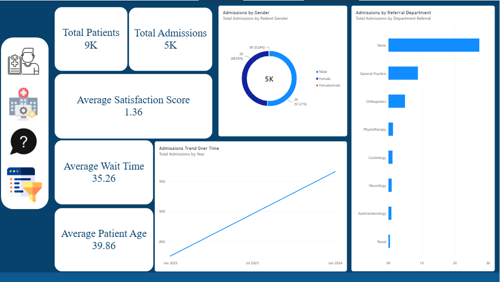
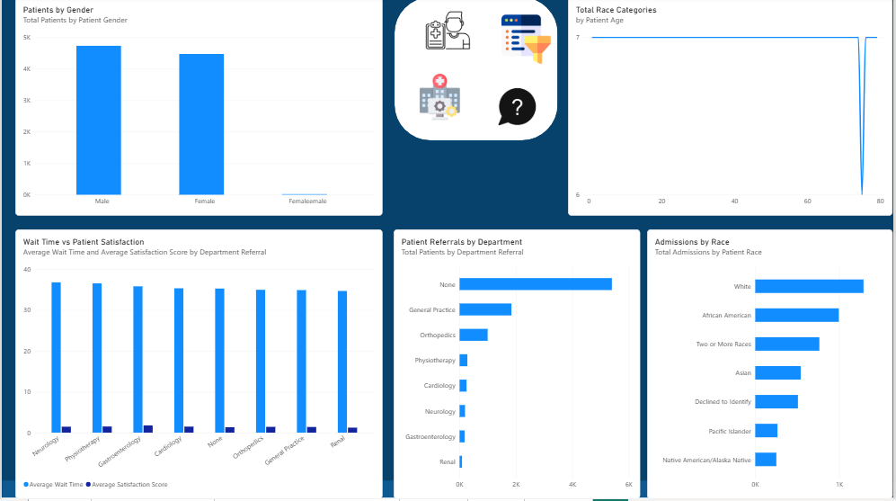
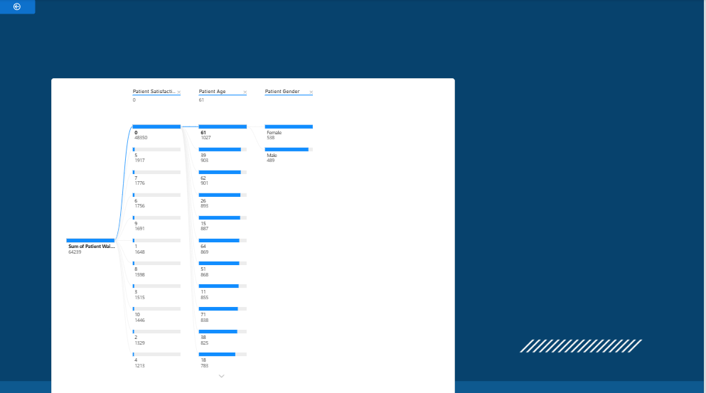
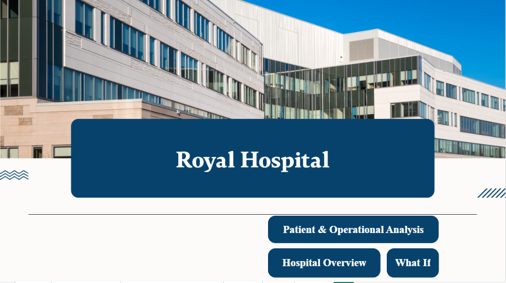

# Royal-Hospitl
# 🏥 Royal Hospital – Healthcare Analytics Dashboard

## 📌 Project Overview

Royal Hospital is an interactive healthcare analytics solution developed using Microsoft Power BI to transform hospital and patient data into actionable insights.

The dashboard provides an executive-level overview of hospital performance while allowing users to investigate patient demographics, admissions, referral departments, waiting times, satisfaction levels, and operational patterns.

Rather than focusing only on descriptive reporting, the project was designed around three analytical questions:

- **What is happening?**
- **Why is it happening?**
- **What could happen under different scenarios?**

This approach combines descriptive analytics, diagnostic analysis, drill-through exploration, and What-If scenario modeling in a single Power BI solution.

---

## 🎯 Business Objectives

The dashboard was designed to help hospital management:

- Monitor overall patient and admission volumes.
- Understand patient demographic patterns.
- Analyze admissions across referral departments.
- Evaluate patient waiting time and satisfaction.
- Identify relationships between patient characteristics and operational outcomes.
- Investigate the potential causes behind waiting-time patterns.
- Simulate operational scenarios and estimate their potential impact.

---

## 📊 Dashboard Structure

The solution consists of four main analytical sections:

### 1. Hospital Overview

The executive overview provides a high-level snapshot of hospital activity through key performance indicators and visual trends.

#### Key KPIs

- Total Patients: **9K**
- Total Admissions: **5K**
- Average Satisfaction Score: **1.36**
- Average Wait Time: **35.26**
- Average Patient Age: **39.86**

#### Main Visuals

- Admissions by Gender
- Admissions by Referral Department
- Admissions Trend Over Time
- Hospital-level KPI cards

This page is designed to answer:

> **What is happening in the hospital?**

---

### 2. Patient & Operational Analysis

The analytical page explores patient demographics and operational performance in greater detail.

#### Key Analyses

- Patients by Gender
- Patient Race Distribution
- Patient Referrals by Department
- Admissions by Race
- Average Wait Time by Department
- Average Patient Satisfaction Score by Department

This page helps identify differences between departments and patient groups and provides a more detailed view of hospital operations.

---

### 3. Why Analysis

The Why Analysis page is designed for diagnostic exploration.

Using interactive filtering and decomposition-style analysis, users can investigate how different patient characteristics relate to waiting time.

The analysis allows exploration across dimensions such as:

- Patient Satisfaction
- Patient Age
- Patient Gender
- Patient Waiting Time

This section shifts the dashboard from simply showing **what happened** to investigating:

> **Why is this happening?**

---

### 4. What-If Scenario Analysis

The What-If page introduces interactive scenario modeling to evaluate potential operational changes.

Users can adjust parameters such as:

- Admission Rate Scenario
- Satisfaction Improvement
- Wait Time Reduction

The dashboard then updates scenario-based metrics including:

- Scenario Admissions
- Scenario Wait Time

This allows hospital decision-makers to explore hypothetical operational changes before implementing them.

The key question is:

> **What could happen if we change an operational factor?**

---

## 📈 Key Insights

The dashboard highlights several important areas for hospital management:

### Patient Volume

The hospital dataset represents approximately **9K patients** and **5K admissions**, providing a substantial basis for analyzing patient flow and hospital utilization.

### Waiting Time

Average patient waiting time is approximately **35.26**, making waiting time an important operational metric to monitor.

### Patient Satisfaction

The average satisfaction score is **1.36**, creating an opportunity to investigate the relationship between patient experience and operational performance.

### Referral Departments

Patient referrals are concentrated in specific departments, with General Practice representing a major referral source.

### Admissions Trend

Admissions show an upward trend across the analyzed period, providing an important signal for capacity and resource planning.

### Demographic Analysis

The dashboard provides demographic breakdowns by gender and race, allowing hospital management to understand the composition of the patient population and admissions.

---

## 🧠 Analytical Approach

The project follows a structured analytics framework:

### Descriptive Analytics

Understanding:

- Patient volume
- Admissions
- Demographics
- Referral departments
- Waiting time
- Satisfaction

### Diagnostic Analytics

Investigating:

- Why waiting time varies
- How satisfaction differs across departments
- Which patient characteristics are associated with operational outcomes

### Scenario Analysis

Testing:

- Admission rate changes
- Waiting-time reduction
- Satisfaction improvement

This creates a progression from:

**What happened → Why did it happen → What could happen?**

---

## 🛠️ Tools & Technologies

- **Microsoft Power BI**
- **Power Query**
- **DAX**
- **Data Modeling**
- **Data Visualization**
- **What-If Parameters**
- **Interactive Filtering**
- **Drill-through / Diagnostic Analysis**

---

## 🎨 Dashboard Design

The dashboard uses a consistent healthcare-oriented visual identity with:

- Dark blue background
- White analytical cards
- Clear KPI hierarchy
- Consistent typography
- Minimal visual clutter
- Interactive analytical pages

The navigation structure was designed to guide users from executive-level insights toward deeper diagnostic and scenario analysis.

---

## 📂 Dashboard Pages

| Page | Purpose |
|---|---|
| Hospital Overview | Executive performance overview |
| Patient & Operational Analysis | Detailed patient and operational analysis |
| Why Analysis | Diagnostic exploration |
| What-If | Scenario simulation and decision support |

---

## 💡 Business Value

The project demonstrates how Power BI can be used beyond traditional reporting.

Instead of simply presenting historical numbers, the dashboard supports:

- Performance monitoring
- Operational analysis
- Root-cause exploration
- Patient experience analysis
- Capacity planning
- Scenario-based decision making

This makes the solution useful for hospital managers, operational teams, and healthcare decision-makers.

---

## 🚀 Skills Demonstrated

- Healthcare Data Analytics
- Business Intelligence
- Data Visualization
- Dashboard Development
- DAX
- Power Query
- Data Modeling
- KPI Development
- Diagnostic Analytics
- What-If Analysis
- Interactive Reporting
- Business Storytelling

---

## 📸 Dashboard Preview

### Hospital Overview

### Patient & Operational Analysis

### Why Analysis

### What-If Scenario

### Cover

---

## 👤 Author

**ALDRDA ALI**  
Data Analyst | Business Intelligence

Focused on transforming raw data into actionable business insights using:

**Power BI | SQL | Excel | Python | Tableau**

---

## 🔗 Project Repository

[View the project on GitHub](https://github.com/aldrda/Royal-Hospitl)

demo : 
